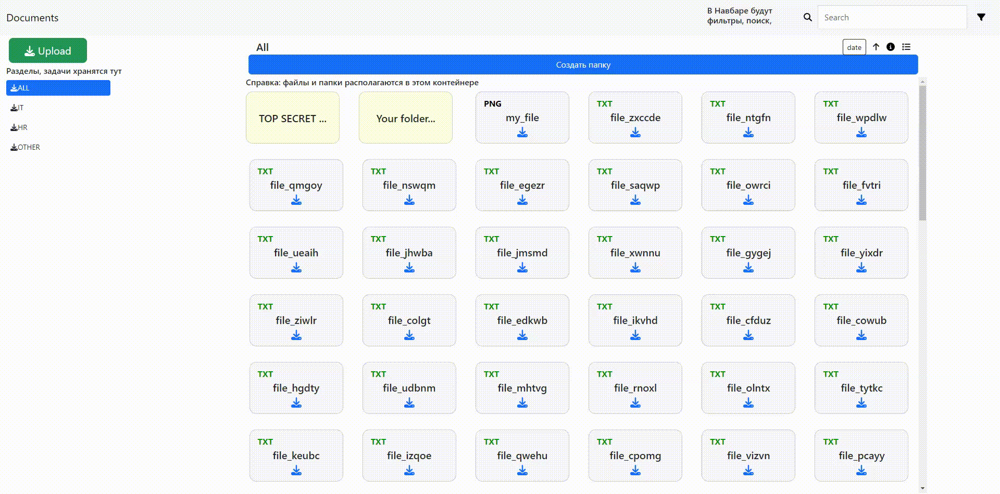

# Remote-storage
This project implement storaging files with Django 4.1 and React 18.x.



## Feature
* File uploading
* Folder creating
* Drag n drop
* Mobile adaptive
* Searching (*debounced*), filtering

## Dependecies
* Python >=3.11
* Django >=4.1
* React >=18.0
* npm

## Build python

### Linux

```bash
git clone https://github.com/timofeevAS/remote-storage
cd ./remote-storage
python -m venv .venv
cd ./.venv/Scripts
./activate
cd ../..
```

### Windows

```bash
git clone https://github.com/timofeevAS/remote-storage
cd remote-storage
python -m venv .venv
cd .venv\Scripts
activate
cd ..\..
```

**Next step requirements:**

```bash
pip install -r requirements.txt
```

**Configure backend:**
```bash
cd myapp
python manage.py makemigrations sender
python manage.py migrate
python manage.py createsuperuser
python manage.py data_gen
```
Waiting a little and your backend will be configured with output:

`Data generation complete`


**Configure frontend**

0. You can easily install [Node.js](https://nodejs.org) and follow next step

**Open terminal in your directory (remote-storage):**
```bash
cd myapp
npm install
npm run dev
```
**Execute process with `CTRL+C` and type `Yes`**

```bash
python manage.py 8000
```


## Let's launch:
Visit site: `http://127.0.0.1:8000`
For look admin panel: `http//127.0.0.1:8000/admin`